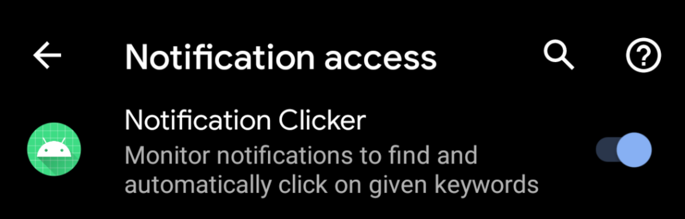

# Notification Clicker

Click on buttons on Android notifications, such as 'Skip Intro' on Netflix rather than do it every damn episode.

Install (apk available in `Releases`) and then go to Settings -> Notification access to enable.

TODO:
- Allow configurable keywords per app the user has installed